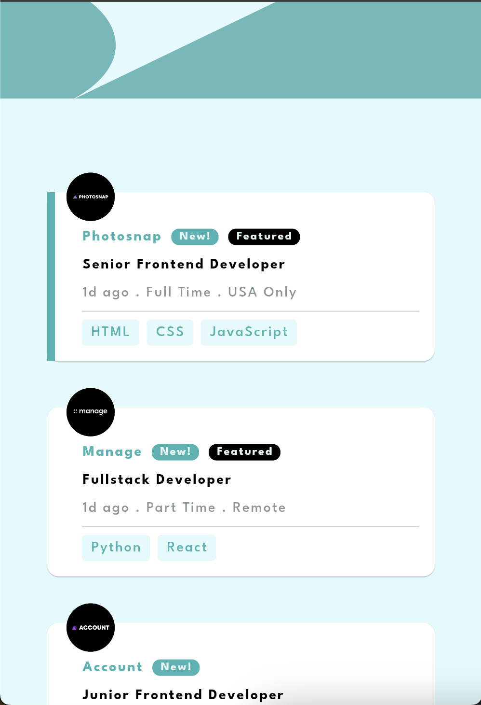
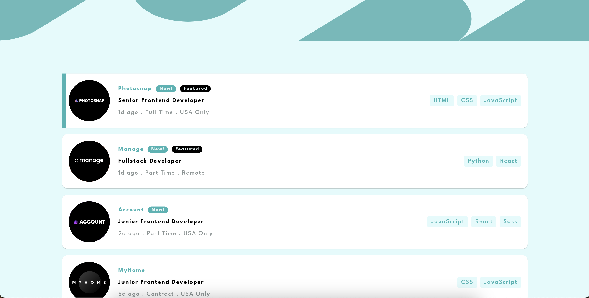
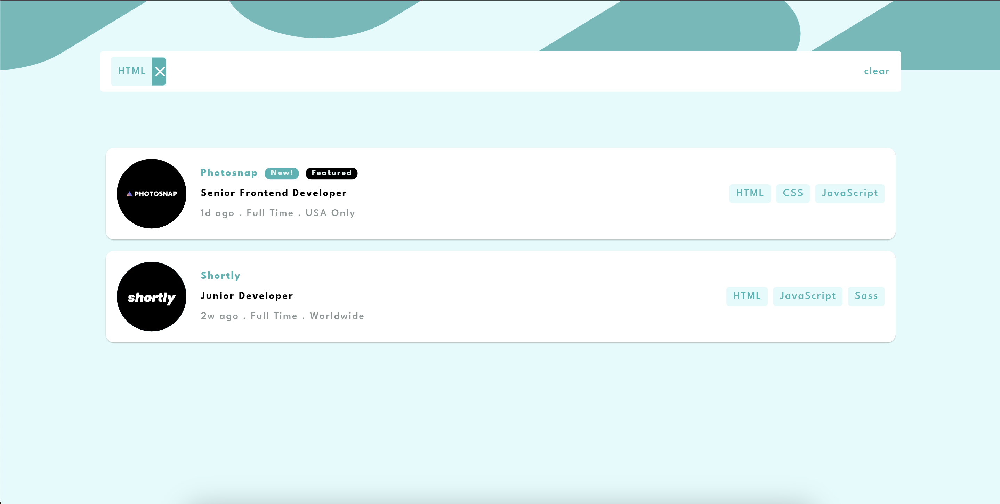

# Job Listing Flutter Project

This Flutter project displays job listings from a JSON file and allows filtering according to the stack. The project supports both mobile and desktop versions.

## Features

- Display job listings from a JSON file
- Filter jobs based on stack
- Responsive design for mobile and desktop
- Hover effect on job cards for desktop view

## Screenshots

### Mobile Version


### Desktop Version



## Installation

1. **Clone the repository:**
   ```bash
   git clone https://github.com/YourUsername/job-listing-flutter-project.git
   cd job-listing-flutter-project
